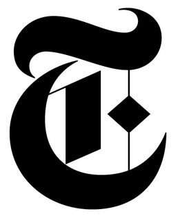

<a name="readme-top"></a>

<!-- PROJECT LOGO -->
<br />
<div align="center">
  <a href="https://github.com/alinix1/ny-times-news-reader">
    
  </a>

  <!-- HEADER -->
<h3 align="center">NY Times News</h3>
  <p align="center">
    An application consisting of the latest and greatest news articles 📰
    <br />
    <a href="https://github.com/alinix1/ny-times-news-reader"><strong>Explore the docs »</strong></a>
    <br />
    <a href="">Visit the Deployed Site »</strong></a>
  </p>

<!-- TABLE OF CONTENTS -->
<details>
  <summary>Table of Contents</summary>
  <ol>
    <li>
      <a href="#about-the-project">About The Project</a>
      <ul>
        <li><a href="#built-with">Built With</a></li>
      </ul>
    </li>
    <li><a href="#setup">Setup</a></li>
    <li><a href="#usage">Installation</a></li>
    <li><a href="#usage">Usage</a></li>
    <li><a href="#notes">Notes</a></li>
    <li><a href="#roadmap">Roadmap</a></li>
    <li><a href="#roadmap">Acknowledgments</a></li>
    <li><a href="#contact">Contact</a></li>
  </ol>
</details>
</div>

<!-- ABOUT THE PROJECT -->

## About The Project

<!-- provide a few screenshots -->

<!-- This is a web application built to provide a particular selection of music to facilitate focus while at work. It was created for the Turing School of Software and Design's Module 3 final showcase project. The goal was to apply the new technologies learned and work within constraints to deliver a product for a niche audience, which helps solve a unique problem. -->

### Built With

- ![React][React-shield]
- ![React Router][React-Router-shield]
- ![JavaScript][JavaScript-shield]
- ![CSS][CSS-shield]
- ![SASS][SASS-shield]
- ![Cypress][Cypress-shield]
- ![Playwright][Playwright-shield]

- ![Vercel][Vercel-shield]
- ![Webpack][Webpack-shield]

<p align="right">(<a href="#readme-top">back to top</a>)</p>

<!-- SETUP -->

## Setup

- Visit [Deployed Site]()

<p align="right">(<a href="#readme-top">back to top</a>)</p>

<!-- INSTALLATION -->

## Installation

1.  Clone down both repos, adding them to separate directories:

```sh
git clone git@github.com:alinix1/showcase-project-api.git
```

```sh
git clone git@github.com:alinix1/showcase-project-fe.git
```

2.  For front-end repository: Install NPM packages

```sh
npm i or npm install
npm start
```

For API repository: Install NPM packages

```sh
npm i or npm install
node server.js
```

<!-- USAGE -->

## Usage

<!-- Provide a GIF or two -->

<p align="right">(<a href="#readme-top">back to top</a>)</p>

<!-- NOTES -->

## Notes

## Feature Overview

- React framework
- React Router
- E2E Testing with Cypress and Playwright
- SASS/SCSS
- Typechecking with PropTypes
- Deployment on Vercel

## Wins:

-
-
-

## Challenges:

-
-
-

<p align="right">(<a href="#readme-top">back to top</a>)</p>

<!-- ROADMAP -->

## Roadmap

- [ ]
- [ ]
- [ ]

<!-- ACKNOWLEDGMENTS -->

## Acknowledgments

Used the following resources during the project:

- [![MDN Docs][mdn-shield]][mdn]
- [](https://turing.edu/)

<!-- CONTACT -->

## Contact

Ali Nix | [![LinkedIn][linkedin-shield]][linkedin-url1]

<p align="right">(<a href="#readme-top">back to top</a>)</p>

<!-- MARKDOWN LINKS & IMAGES -->

[React-shield]: https://img.shields.io/badge/react-%2320232a.svg?style=for-the-badge&logo=react&logoColor=%2361DAFB
[React-Router-shield]: https://img.shields.io/badge/React_Router-CA4245?style=for-the-badge&logo=react-router&logoColor=white
[JavaScript-shield]: https://img.shields.io/badge/JavaScript-F7DF1E?style=for-the-badge&logo=javascript&logoColor=black
[CSS-shield]: https://img.shields.io/badge/CSS3-1572B6?style=for-the-badge&logo=css3&logoColor=white
[SASS-shield]: https://img.shields.io/badge/Sass-CC6699?style=for-the-badge&logo=sass&logoColor=white
[Cypress-shield]: https://img.shields.io/badge/-cypress-%23E5E5E5?style=for-the-badge&logo=cypress&logoColor=058a5e
[Playwright-shield]: https://img.shields.io/badge/Playwright-45ba4b?style=for-the-badge&logo=Playwright&logoColor=white
[Vercel-shield]: https://img.shields.io/badge/Vercel-000000?style=for-the-badge&logo=vercel&logoColor=white
[Webpack-shield]: https://img.shields.io/badge/webpack-%238DD6F9.svg?style=for-the-badge&logo=webpack&logoColor=black
[linkedin-shield]: https://img.shields.io/badge/-LinkedIn-black.svg?style=for-the-badge&logo=linkedin&colorB=555
[linkedin-url1]: https://www.linkedin.com/in/ali-nix-38b9b9126/
[turing-shield]: https://turing.edu/?ads_cmpid=1064466865&ads_adid=72751730870&ads_matchtype=b&ads_network=g&ads_creative=341753979066&utm_term=turing%20school&ads_targetid=kwd-307330888202&utm_campaign=&utm_source=adwords&utm_medium=ppc&ttv=2&gclid=Cj0KCQiAyMKbBhD1ARIsANs7rEHyZFP9Q4MTY1TMh4gsr49nBTFwyCrmEUtwwnHYpw_9krf7yiB_R1gaAiIfEALw_wcB
[mdn]: https://developer.mozilla.org/en-US/
[mdn-shield]: https://img.shields.io/badge/MDN_Web_Docs-black?style=for-the-badge&logo=mdnwebdocs&logoColor=white
